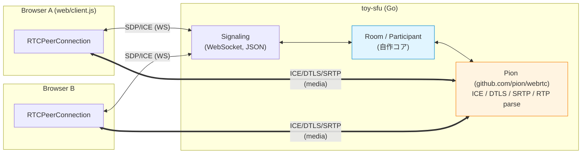
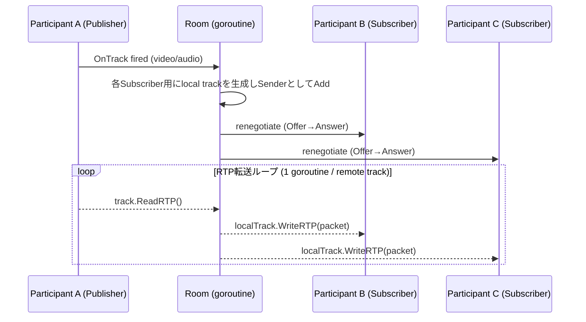

# toy-sfu 設計書

- 日付: 2026-07-04
- 目的: WebRTCの理解を深めるため、SFU（Selective Forwarding Unit）をGoで独自構築する学習プロジェクト
- 背景: GH-5317（minedia-www の OpenTok→LiveKit セルフホスト移行）を担当しており、LiveKit内部（Go + Pion）の理解を深めたい

## 目的とスコープ

**目的**: SFUの核心（RTPパケットのファンアウト転送、Room/Participant管理、リネゴシエーション）を自分の手で実装し、体感的に理解する。ICE/DTLS/SRTPのようなプロトコル層は既存のObsidianノート（`00 WebRTC 学習マップ`、`WebRTC 1.0`、`メディア層の全景` 等）で理論を押さえているため、実装せずライブラリ（Pion）に任せる。

**機能スコープ（MVP）**:
- ブラウザ2〜3タブでの接続
- 1 publisher → N subscriber の音声/映像転送
- Room入退室管理
- WebSocketでのSDP/ICE candidate中継（自作signaling）

**スコープ外**:
- Simulcast / Adaptive Stream
- TURN（同一ネットワーク前提、STUNのみ使用）
- 認証・マルチテナント
- 録画・Webhook
- 自動再接続・ICE Restart
- 本番運用を意識した設定（TLS終端、水平スケール等）

## アーキテクチャ



参加者ごとに1本のPeerConnectionを持ち、自分のトラックを送信しつつ他の参加者から転送されてきたトラックを受信する構成（Pion公式サンプル `sfu-ws` と同型のパターン）。

**自分で書く部分（学習の主眼）**:
- Room / Participant のライフサイクル管理（入退室）
- Publisherの RTP パケットを他の全 Subscriber へ転送するファンアウトロジック
- 新規トラック追加時の SFU 側からのリネゴシエーション（Offer 再生成 → WS 経由送信 → ブラウザが Answer）

**Pionに任せる部分**: ICE疎通、DTLS鍵交換、SRTP暗号化/復号、RTP/RTCPパース

## プロジェクト構成

```
~/repo/toy-sfu/
  cmd/sfu/main.go            - エントリポイント（HTTP + WebSocketサーバー起動）
  internal/room/room.go      - Room, RoomManager
  internal/room/participant.go - Participant, RTP転送ロジック
  internal/signaling/ws.go   - WebSocketハンドラ、メッセージ型
  web/index.html, web/client.js - 自作の最小ブラウザテストクライアント
  go.mod
```

## シグナリングプロトコル

WebSocketメッセージ（JSON、自作の最小プロトコル）:

| type | 方向 | 内容 |
|---|---|---|
| `join` | Client→Server | `{room: string}` — Room不在なら新規作成 |
| `offer` | Client→Server（初回）/ Server→Client（トラック追加時の再ネゴ） | `{sdp: string}` |
| `answer` | 相手方向 | `{sdp: string}` |
| `ice-candidate` | 双方向 | `{candidate: RTCIceCandidateInit}` |
| （close） | ソケット切断で暗黙的にleave | Room内の他participantへ再ネゴをトリガー |

初回接続は**ブラウザがOfferを作成**（自分のマイク/カメラトラックを載せて）し、サーバーがAnswerを返す。以後、他の参加者が参加してトラックが増えるたびに**サーバー側がOfferを作り直して再送**（renegotiation）し、ブラウザがAnswerを返す非対称な流れとする。

ICE設定はSTUNのみ（例: `stun:stun.l.google.com:19302`）。TURNは使用しない。

## RTP転送のデータフロー



## 並行処理モデル

- リモートトラック1本につき1 goroutineがブロッキングでRTPを読み続け、購読者のローカルトラックへ書き込むだけのシンプルなファンアウト
- Room内のparticipantマップは `sync.Mutex` で保護し、入退室・トラック追加時のみロックを取得する（転送ループ自体はロック不要）

## エラーハンドリング

- WS切断・PeerConnection failed → ログ出力してParticipantをRoomから除去、他参加者に再ネゴをトリガー
- 再接続・ICE Restartは実装しない（切断時はページリロードで再接続する運用）
- リネゴシエーション中の競合（glare）は最初は考慮せず、問題が発生した場合に都度対処する

## 検証方法

- 自動テストは最小限（Room/Participantの入退室ロジック程度のユニットテスト）に留める
- RTP転送の正しさはブラウザ2〜3タブでの手動確認を主軸とする
- 既存の診断スキル（`chrome://webrtc-internals` の candidate-pair / inbound-rtp、`signalingState` / `iceConnectionState`）で自作SFUの動作を検証する。この点が学習ノート群と実装をつなぐ核

## 関連ノート

- [[00 WebRTC 学習マップ]] — 索引・核心モデル
- [[WebRTC 1.0 - Real-time Communication Between Browsers]] — RTCPeerConnection / RTCRtpTransceiver 等
- [[メディア層の全景 - RTP・SRTP・RTCP の使われ方]] — RTP/SRTP/RTCPの詳細
- GH-5317（minedia-www インタビュー機能外部化）— この学習の実務上の動機
